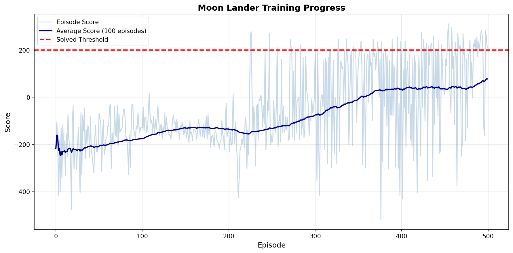
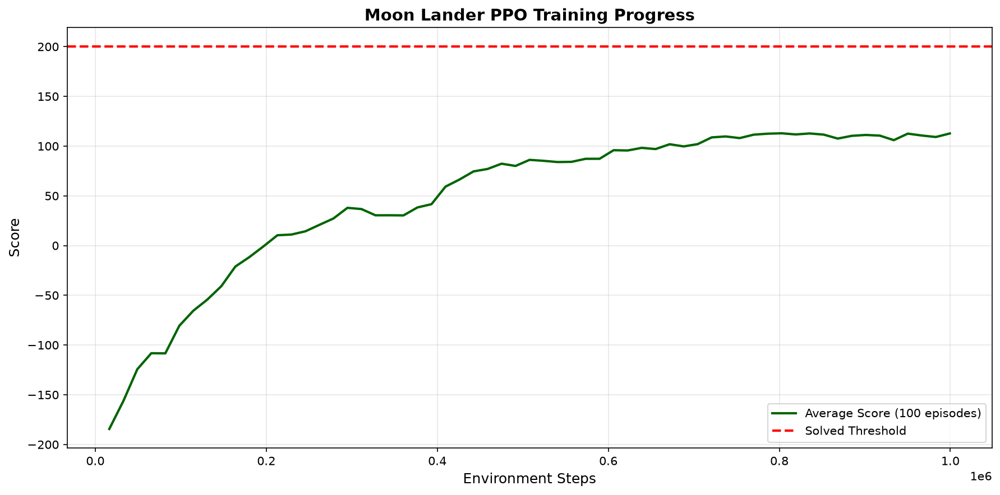
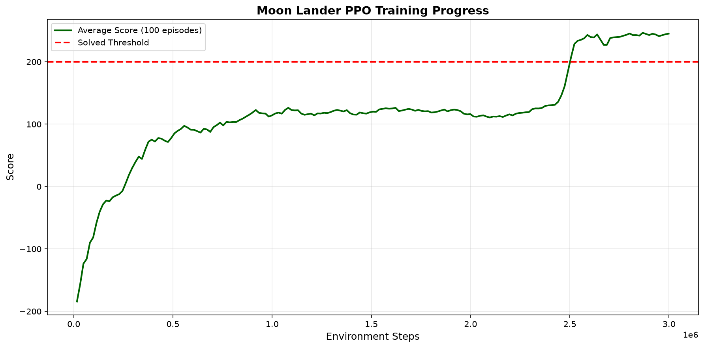
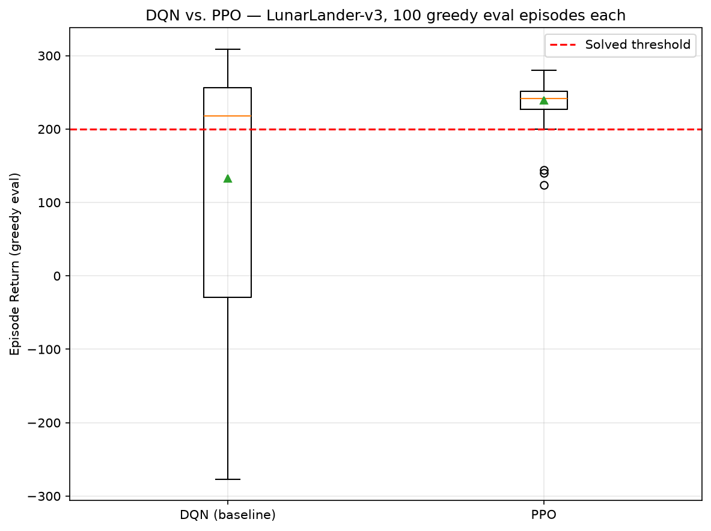

# 🚀 Moon Lander RL — DQN and PPO for LunarLander

> Two RL agents trained on OpenAI Gymnasium's `LunarLander-v3`: an original from-scratch **DQN** baseline, and a newer **PPO** agent — with periodic checkpointing, recorded rollouts, a head-to-head evaluation, and a modular RL component library.


---

**Status:** Two working, independently trained agents with genuine committed training runs. The original **DQN** baseline improves substantially over ~500 episodes but does **not** cross the LunarLander "solved" threshold (100-episode mean reward ≥ 200) within that budget. A newer **PPO** agent, added later, **does solve the environment** (100-episode avg ≥ 200 at step 2,506,752) and evaluates far more consistently — see [Results](#results) for the full head-to-head, including the honest story of an initial PPO hyperparameter attempt that *also* failed to solve it. Double/Dueling DQN and Prioritized Experience Replay still exist as unwired scaffolding in `src/` — see [Future Work](#future-work).

---

## Overview

`LunarLander` is a classic continuous-state, discrete-action control problem: an 8-dimensional observation (position, velocity, angle, leg contacts) and 4 actions (do nothing, fire left / main / right engine). The environment is considered "solved" at a 100-episode average reward of **200**. This project implements two agents from scratch in PyTorch: a **Deep Q-Network (DQN)** and a **Proximal Policy Optimization (PPO)** agent, and evaluates them head-to-head under identical conditions.

## Methodology

**Algorithm — Deep Q-Network (Mnih et al., 2015):**

- **Q-network:** a 3-layer MLP, `state(8) → FC(128) → ReLU → FC(128) → ReLU → Q-values(4)`.
- **Target network:** a periodically synced copy (every 10 episodes) for stable TD targets.
- **Experience replay:** a uniform `deque`-backed buffer (capacity 100k) sampled in minibatches of 64.
- **Loss:** MSE on the Bellman target `r + γ · maxₐ Qₜₐᵣ𝓰ₑₜ(s′, a) · (1 − done)`.
- **Exploration:** ε-greedy with exponential decay (ε: 1.0 → 0.01, decay 0.995).
- **Optimizer:** Adam, learning rate 1e-3, γ = 0.99.

**DQN training loop** (`train.py`, mirrored in `moon_lander_training.ipynb`): runs up to 500 episodes, syncs the target network and checkpoints periodically, tracks the rolling 100-episode average, and stops early if that average reaches 200.

```
┌──────────────┐   ε-greedy    ┌──────────────┐   (s,a,r,s′,done)   ┌────────────────┐
│ Environment  │ ───action───► │  DQN Agent   │ ──────store───────► │ Replay Buffer  │
│ LunarLander  │ ◄──reward───  │ (Q + target) │ ◄─────sample──────  │   (100k cap)   │
└──────────────┘               └──────┬───────┘                     └────────────────┘
                                      │ MSE TD-loss → Adam → backprop
                                      ▼
                          target network sync every 10 ep
```

**Algorithm — Proximal Policy Optimization (Schulman et al., 2017, arXiv:1707.06347):**

- **Actor-critic network:** shared-input, separate heads — `state(8) → FC(64) → Tanh → FC(64) → Tanh → {policy logits(4), value(1)}`, orthogonal init (policy head gain 0.01, per Huang et al. 2022's "37 Implementation Details of PPO").
- **Rollout:** 16 parallel `SyncVectorEnv` environments, 1024 steps each per update (batch = 16,384 transitions).
- **Advantage estimation:** Generalized Advantage Estimation, GAE(λ) (Schulman et al., 2016, arXiv:1506.02438).
- **Objective:** clipped surrogate policy loss (clip=0.2) + clipped value loss + entropy bonus, 4 epochs over 64-sized minibatches per update.
- **Optimizer:** Adam, learning rate 3e-4 with linear annealing, γ = 0.999, λ = 0.98.

Hyperparameters (`num_envs`, `num_steps`, `gamma`, `gae_lambda`, `ent_coef`, `update_epochs`) are the tuned values published for `LunarLander-v3` in [RL Baselines3 Zoo](https://github.com/DLR-RM/rl-baselines3-zoo) (`hyperparams/ppo.yml`, verified against the raw file). This mattered in practice — see [Results](#results).

```
┌──────────────┐  16× parallel  ┌───────────────┐  rollout (16384 steps)  ┌─────────────────┐
│ Environment  │ ─────action──► │  PPO Agent    │ ───────────────────────►│ GAE(λ) advantage│
│ LunarLander  │ ◄────reward─── │ (actor+critic)│ ◄────clipped surrogate──│  + returns      │
└──────────────┘                └───────────────┘   4 epochs × minibatch  └─────────────────┘
```

## Tech Stack & Tools

| Area | Tools |
|------|-------|
| RL environment | **Gymnasium** (`LunarLander-v3`, Box2D, vectorized `SyncVectorEnv`) |
| Deep learning | **PyTorch** (`nn`, `optim`, `distributions.Categorical`, autograd) |
| Numerics & viz | **NumPy**, **Matplotlib** |
| Video capture | `imageio`, Gymnasium `rgb_array` rendering |
| Tooling | **pytest**, `tqdm`, **Makefile** |

## Results

### DQN (original baseline)

The committed `training_progress.png` is from a real 500-episode DQN run: the 100-episode moving average rises from roughly −200 (random policy) to about +50–75 by episode ~500, but does not stabilize above the +200 solved line within that budget.



### PPO (new)

**First attempt, honestly reported:** an initial PPO run with ad-hoc hyperparameters (`gamma=0.99`, `gae_lambda=0.95`, 8 envs × 128 steps) plateaued around avg(100)=+18 and never solved the environment — worse than the DQN baseline. Root cause: LunarLander episodes run long, so credit assignment needs a discount factor closer to 1, and the small rollout/batch size made the on-policy updates noisy. Swapping to RL Baselines3 Zoo's verified tuned config (`gamma=0.999`, `gae_lambda=0.98`, 16 envs × 1024 steps) fixed it:



**Final PPO run:** solved LunarLander-v3 (100-episode avg ≥ 200) at **step 2,506,752**, and continued improving to a final 100-episode average of **245.19** (best avg 246.54) by 3,000,000 steps.



### Head-to-head evaluation

`evaluate_agents.py` loads both agents' final checkpoints and runs **100 greedy (non-exploratory), seeded episodes each** under identical conditions — deliberately separate from the training-time rolling average, which for DQN includes epsilon-greedy noise and for PPO includes on-policy sampling noise:

| Agent | Mean | Std | Median | Min | Max | Solve rate (≥200) |
|---|---:|---:|---:|---:|---:|---:|
| DQN (baseline) | 133.12 | 157.64 | 218.14 | −276.93 | 308.47 | 56.0% |
| **PPO** | **238.73** | **26.04** | 241.86 | 124.12 | 280.06 | **96.0%** |



PPO is not just higher-scoring on average — it is dramatically more *consistent* (std 26 vs. 158). The DQN baseline's wide variance (occasional −276 crashes alongside 308 near-perfect landings) is a direct symptom of never fully converging past the solved threshold; PPO's tight distribution is what "solved" is supposed to look like.

Reproducible artifacts in the repo:

- **DQN checkpoints:** `checkpoints/checkpoint_ep{50…450}.pth`, `checkpoints/final_ep499.pth`.
- **PPO checkpoints:** `checkpoints_ppo/ppo_step{…}.pth`, `checkpoints_ppo/ppo_solved_step2506752.pth`, `checkpoints_ppo/ppo_final_step2998272.pth`.
- **Rollout videos:** `videos/episode_{050…499}_run_{1,2}.mp4` + `perfect_landing.mp4` (DQN); `videos/ppo_run_{1,2,3}.mp4` + `ppo_best_landing.mp4` (PPO, 10/10 successful landings across 10 evaluation attempts).
- **Raw eval data:** `agent_comparison.json` (per-episode returns for both agents).

> No "solved-at-episode-N" or final-score figures are claimed beyond what the committed training curves, checkpoints, and `agent_comparison.json` directly support.

## Project Structure

```
moon_lander_rl/
├── train.py                     # DQN agent + training loop (entry point)
├── train_ppo.py                 # PPO agent + vectorized training loop
├── evaluate_agents.py           # head-to-head DQN vs PPO evaluation (100 greedy episodes each)
├── test.py                      # evaluate a trained DQN agent
├── record_videos.py             # render DQN rollouts to MP4
├── record_ppo_videos.py         # render PPO rollouts to MP4
├── moon_lander_training.ipynb   # notebook version of the DQN training pipeline
├── training_progress.png        # DQN training reward curve
├── ppo_training_progress.png    # PPO training reward curve (final, tuned run)
├── agent_comparison.png         # DQN vs PPO box-plot comparison
├── agent_comparison.json        # raw per-episode eval returns for both agents
├── src/                         # modular RL components
│   ├── replay_buffer.py         # uniform experience replay (DQN)
│   ├── priority_buffer.py       # prioritized replay (scaffolding for PER, DQN)
│   ├── epsilon_scheduler.py     # ε-greedy decay schedules (DQN)
│   ├── normalizer.py            # observation normalization
│   ├── ppo_agent.py             # ActorCritic network, GAE, clipped-surrogate update
│   ├── ppo_config.py            # PPO hyperparameters (RL-Zoo-verified defaults)
│   ├── checkpoint.py, metrics.py, config.py, seed_utils.py
├── tests/                       # pytest suite (DQN components + PPO: GAE, network shapes, update step)
├── checkpoints/                 # saved DQN checkpoints (ep50 … ep499)
├── checkpoints_ppo/             # saved PPO checkpoints (incl. ppo_solved_step2506752.pth)
├── videos/                      # recorded landing rollouts, both agents
└── requirements.txt
```

## Key Features

- **Two from-scratch agents** — DQN (target network + experience replay) and PPO (actor-critic, GAE, clipped surrogate) — sharing one environment and evaluation harness for a fair comparison.
- **Resumable training** — checkpoints store network, optimizer, and training state for both agents.
- **Reproducibility helpers** — `seed_utils.py`, typed `DQNConfig`/`PPOConfig` dataclasses, seeded evaluation episodes.
- **Visual evidence** — recorded MP4 rollouts at multiple training stages for both agents.
- **Tested components** — unit tests for the replay buffer, ε-scheduler, metrics, checkpointing, and (for PPO) GAE correctness against hand-derived cases, network output shapes, and that an update step actually moves the weights.
- **Honest tuning narrative** — the PPO section documents an initial hyperparameter attempt that *didn't* solve the environment, not just the final tuned result.

## Getting Started

```bash
git clone https://github.com/ejazfahil/moon_lander_rl.git
cd moon_lander_rl
pip install -r requirements.txt

# train DQN from scratch (up to 500 episodes, early-stops if solved)
python train.py

# train PPO from scratch (defaults: RL-Zoo-tuned config, 1M timesteps)
python train_ppo.py
python train_ppo.py --total-timesteps 3000000   # the run that actually solved it

# head-to-head evaluation (100 greedy episodes each)
python evaluate_agents.py

# evaluate / record trained agents
python test.py                 # DQN
python record_videos.py        # DQN
python record_ppo_videos.py    # PPO

# run the component tests
pytest tests/
```

## Challenges

- LunarLander reward is high-variance; the 100-episode average is the meaningful signal, and vanilla DQN converges slowly and noisily near the solved threshold.
- Stability hinges on target-network sync cadence and ε-decay — small changes visibly shift the DQN learning curve.
- **PPO is also hyperparameter-sensitive, not just DQN.** An initial run with textbook-default-ish values (`gamma=0.99`, small rollout batch) plateaued well below the solved threshold — worse than the DQN baseline. The fix wasn't a bug in the algorithm; it was using LunarLander-appropriate values (higher γ for long-horizon credit assignment, a much larger per-update batch for stable on-policy gradients), taken from a verified published reference rather than guessed.

## Future Work

- Wire **Double DQN** and **Dueling DQN** heads into the DQN agent to reduce Q-value overestimation, and activate **Prioritized Experience Replay** via the existing `priority_buffer.py` — these remain unwired scaffolding.
- Extend DQN's training budget / tune its hyperparameters to push its moving average reliably above 200.
- Add seed-averaged learning curves with confidence bands for both agents.
- Try a Rainbow-style combination (Double + Dueling + PER) as a third DQN-family comparison point against PPO.

## Conclusion

Two independently trained, honestly evaluated RL agents on LunarLander-v3: an original DQN baseline that improves steadily but never crosses the solved threshold, and a newer PPO agent — implemented from scratch with GAE and a clipped-surrogate objective — that does, reaching a 245 average reward and a 96% greedy-evaluation solve rate. The PPO section also documents a real tuning failure and its fix, not just the final result, in keeping with this portfolio's "measured, not claimed" standard.
